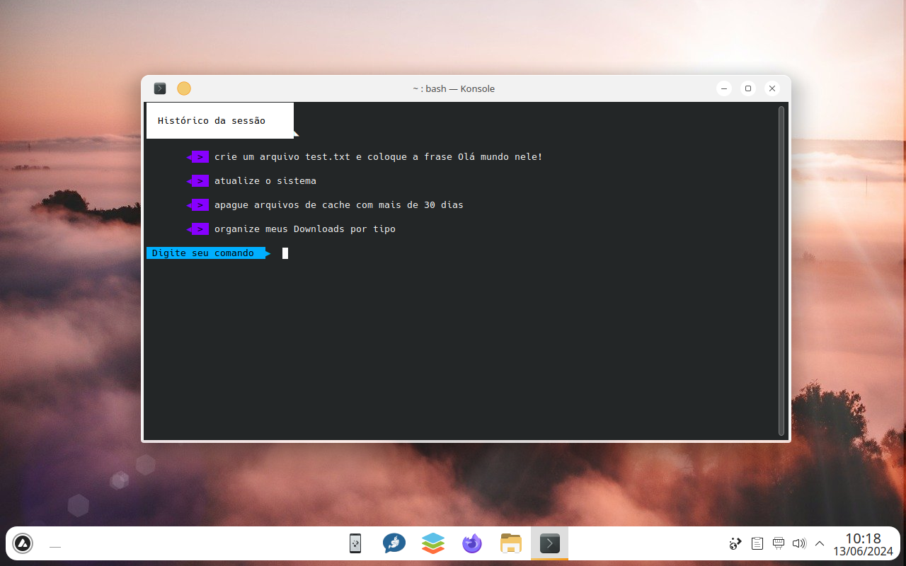

# 📝 Idris v1.1

<p align=center>


Idris é uma ferramenta para converter instruções em linguagem natural em scripts executáveis

</p>

## ✨ Recursos

- **Tolerante a erros**, O Idris tolera um alto grau de erros de digitação sem que isso afete o resultado, por exemplo "pequizar" ainda será entendido como "pesquisar"
- **Leveza**, Idris roda em condições extremas de recursos consumindo menos de 30 MB de RAM e funcionando em CPUs com 400 MHz
- **Offline**, Idris está sempre disponível não depende de conexões com servidores externos
- **Fácil de extender**, forneça um input e o comando que espera sair separado por tab no arquivo `database.tsv`
- **Gratuito**, Idris é completamente gratuito você _não precisa_ pagar para usar
- **Software Livre**, com uma licença permissiva (MIT) você pode modificar, extender e embutir o Idris sem se preocupar
- **Ilimitado**, Como é 100% offline Idris não sofre com limites de uso
- **Instantâneo**, mesmo com bases enormes Idris é capaz de fornecer os comandos instantaneamente

## 📥 Instalação
Clone o repositório:

```bash
git clone https://github.com/natanael-b/idris.git
cd idris
```

> Idris depende de Lua para funcionar

## 🚀 Uso

1. No menu de apps procure por Idrish
2. Digite os prompts e pressione Enter


#### 🖋️ Sintaxe avançada 

```bash
lua5.4 idris.lua --lang=<código do idioma> --database=<banco de dados com comandos> [--prefix=<prefixo>] [--shell-output] [--verbose] [--help] 'entrada 1' 'entrada 2' ...
```

#### ⚙️ Opções

* `--lang=<código do idioma>`: Especifica o idioma a ser usado.
* `--database=<banco de dados>: Define a fonte dos comandos, se não especificado usa o ´idris-shell`
* `--prefix=<prefixo>`: Adiciona um prefixo opcional aos comandos.
* `--shell-output`: Formata a saída para uso em scripts de shell.
* `--interactive`: Entra no modo interativo.
* `--compile`, `-c`: Gera um banco de dados `database.lua` a partir do arquivo `datasheet.tsv`.
* `--update-idris-shell`, `-u`: Modifica o comportamento de `--compile` para atualizar o arquivo `idri-shell.lua`
* `--verbose`, `-v`: Ativa a saída verbosa.
* `--debug`, `-d`: Imprime a localização do banco de dados de cada comando.
* `--help`, `-h`: Exibe a mensagem de ajuda.

### 📌 Exemplos

#### Básico
```bash
lua5.4 idris.lua --lang=pt_BR 'crie um arquivo test.txt e insira a frase Hello World nele!'
```

#### Modo interativo

Para entrar no modo interativo, execute o comando nenhuma entrada:

```
lua5.4 idris.lua --lang=pt_BR --database=idris-shell
```

# 🤝 Contribuição

Contribuições são bem-vindas! Sinta-se à vontade para abrir uma issue ou um pull request.

# 📜 Licença

Este projeto está licenciado sob a Licença MIT. Veja o arquivo LICENSE para mais detalhes.
